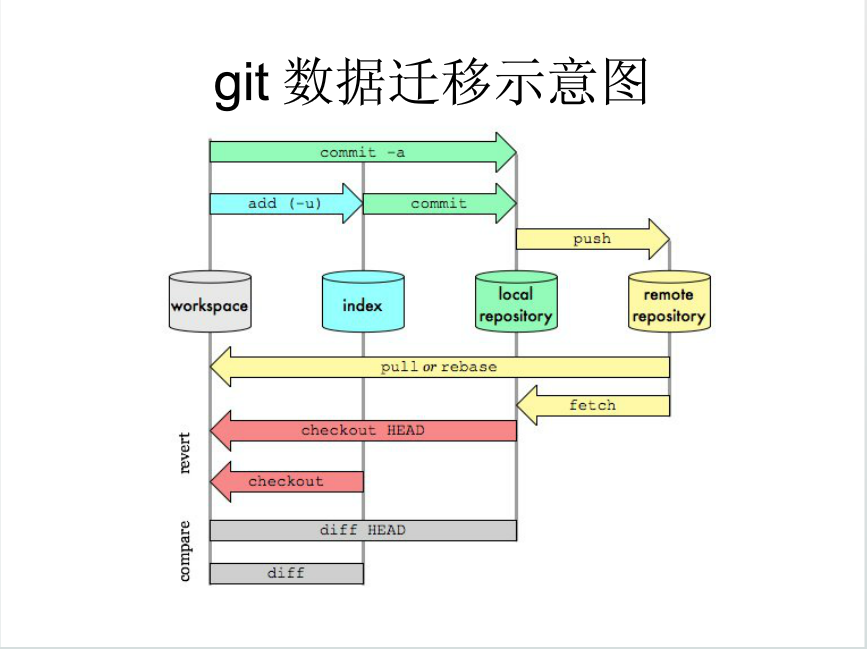

# **GIT学习笔记**

## **GIT的特性**：
* 直接记录快照;
* 去中心化，几乎所有操作都是本地执行（离线操作）;
* 时刻保持数据完整性;
* 多数操作仅仅是添加数据;
* 分支功能简单实用;
* 快速便捷;
* **文件流转的三个工作区域：工作目录、暂存区域、本地仓库**;

***
## **GIT文件系统**：
* 文件的三种状态：
    1. 已提交（commited）- 本地仓库（repository）;
    2. 已暂存（staged）- 暂存区域（staging area）;
    3. 已修改（modified）- 工作目录（working directory）;

* 文件的流转过程：
    1. 工作目录中修改某些文件;
    2. 对修改后的文件进行快照，然后保存到暂存区域;
    3. 提交更新，将保存在暂存区域的文件快照永久转储到GIT目录中;

***
## **GIT数据迁移示意图**


***
## **git status 检查当前文件状态**
* 执行git status命令后对文件状态进行检查，会存在以下三种状态：
    1. Changes to be commited       <已暂存但尚未提交（git add）>
    2. Changes not staged for commit        <已跟踪的文件修改后尚未暂存>
    3. Untracked files      <尚未跟踪的文件>

***
## **查看提交历史**
* git log查看提交历史
默认情况下，git log会按照提交时间列出所有已提交的更新,最近一次的提交排在第一个;
其格式如下：
``` 
commit e0af955e8e7596810949f77e654cd99f199bf200
Author: DearSuperRain <602062748@qq.com>
Date:   Fri Dec 16 22:15:57 2016 +0800

    git commit的提交说明
```
* 主要包含以下信息：
    1. commit hash(SHA-1 校验和);
    2. 作者的名字和电子邮箱地址;
    3. 提交的时间;
    4. 最后会缩进一个段落显示提交说明;

***
## **GIT基本操作**
* git add
    将文件加入到暂存区域;

* git commit
    将暂存区域的文件提交到版本库（仓库）,加上-a选项则表示将已跟但未暂存的文件也包括在内;
* git rm
    删除文件，-cached选项只删除索引，保留文件，即恢复成untracked状态;

***
