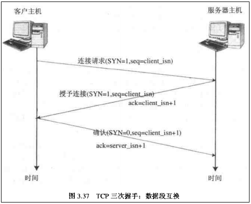
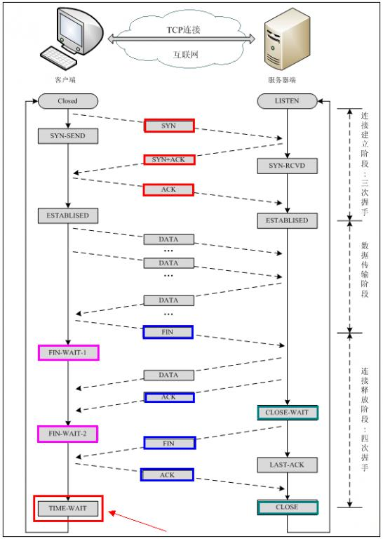
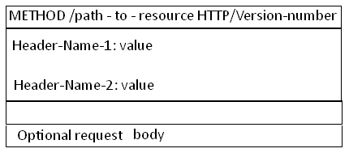
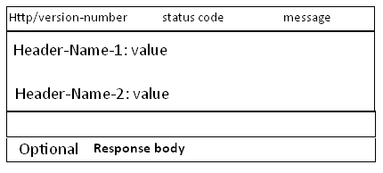

# 《图解HTTP》学习笔记

* TCP/IP是互联网相关的各类协议族的总呼 。

* TCP/IP协议族按层次分别为以下四层：
    1. **应用层**;
    2. **传输层**;
    3. **网络层**;
    4. **数据链路层**;

***

### TCP/IP各层作用：

* **应用层：**
    应用层决定了向用户提供应用服务时通信的活动。
    
    TCP/IP协议族内预存了各类通用的应用服务。比如，FTP（文件传输协议）和DNS(域名系统)服务就是其中两大类。
    **HTTP协议也处于该层。**   

* **传输层：**
    传输层对上层应用层，提供处于网络连接中的两台计算机之间的数据传输。

    在传输层有两个性质不同的协议：TCP(传输控制协议) 和 UDP(用户数据报协议)。

* **网络层（又名网络互连层）：**
    网络层是用来处理在网络上流动的数据包。数据包是网络传输的最小数据单位。

    该层规定了通过怎样的路径(所谓的传输路线)到达对方计算机上，并把数据包传送给对方。

    与对方计算机之间通过多台计算机或网络设备进行传输时,网络层所起的作用就是在众多的选项中选择一条传输路线。

* **链路层（又名 数据链路层、网络接口层）：**
    用来处理连接网络的硬件部分。
    包括控制操作系统、硬件的设备驱动、NIC(网络适配器，即网卡)，及光纤等物理可见部分（还包括连接器等一切传输媒介）。
    硬件上的范畴可在链路层的作用范围之内。

***

### TCP/IP的三次握手：
- 第一次握手：
    建立连接时，客户端发送syn包（syn=j）到服务器，并进入SYN_SENT状态，等待服务器确认；SYN：同步序列编号（Synchronize Sequence Numbers）。

- 第二次握手：
    服务器收到syn包，必须确认客户的SYN（ack=j+1），同时自己也发送一个SYN包（syn=k），即SYN+ACK包，此时服务器进入SYN_RECV状态；

- 第三次握手：
    客户端收到服务器的SYN+ACK包，向服务器发送确认包ACK(ack=k+1），此包发送完毕，客户端和服务器进入ESTABLISHED（TCP连接成功）状态，完成三次握手。
如下图所示：

    完成三次握手，客户端与服务器开始传送数据。如下图所示：

    断开连接时则为四次握手，如图所示：

***

### DNS:
- DNS服务是和HTTP协议一样位于应用层的协议。它提供域名到IP地址之间的解析服务。
- DNS协议提供通过域名查找IP地址，或逆向从IP地址反查域名的服务。

***

### URI和URL：
- **URI（统一资源标识符）**
     **URI**就是由某个协议方案表示的资源的定位标识符。协议方案是指访问资源所使用的协议类型名称。
- **URL（统一资源定位符）**
    **URL**就是某个网页的具体域名。
- **URI和URL的区别：**
    **URI**用字符串标识某一互联网资源，而**URL**表示资源的地点（互联网上所处的位置）。可见**URL**是**URI**的子集。

***

### URI的格式：
- 表示指定的URI，要使用涵盖全部必要信息的绝对URI、绝对URL以及相对URL。
    相对URL，是指从浏览器中基本URI处指定的URL。其格式如图所示：
    
### Request和Response
- request：请求对象
- **Request 消息的结构**
    Request 消息的结构,Request 消息分为3部分，第一部分叫Request line, 第二部分叫Request header, 第三部分是body. header和body之间有个空行， 结构如下图：
    
第一行中的Method表示请求方法,比如"POST","GET",  Path-to-resoure表示请求的资源， Http/version-number 表示HTTP协议的版本号,
当使用的是"GET" 方法的时候， body是为空的。
- response:响应对象
- **Response 消息的结构**
    Response消息的结构, 和Request消息的结构基本一样。 同样也分为三部分,第一部分叫Response line, 第二部分叫Response header，第三部分是body. header和body之间也有个空行,  结构如下图:
    
***

# **HTTP协议是无状态的**
    http协议是无状态的，同一个客户端的这次请求和上次请求是没有对应关系，对http服务器来说，它并不知道这两个请求来自同一个客户端。简而言之便是服务器不知道客户端的状态，服务器只是根据客户端发送的请求，提供与之相对应的数据。
# **HTTP协议是无状态的和Connection: keep-alive的区别**
    无状态是指协议对于事务处理没有记忆能力，服务器不知道客户端是什么状态。从另一方面讲，打开一个服务器上的网页和你之前打开这个服务器上的网页之间没有任何联系

    HTTP是一个无状态的面向连接的协议，无状态不代表HTTP不能保持TCP连接，更不能代表HTTP使用的是UDP协议（无连接）

    从HTTP/1.1起，默认都开启了Keep-Alive，保持连接特性，简单地说，当一个网页打开完成后，客户端和服务器之间用于传输HTTP数据的TCP连接不会关闭，如果客户端再次访问这个服务器上的网页，会继续使用这一条已经建立的连接

    Keep-Alive不会永久保持连接，它有一个保持时间，可以在不同的服务器软件（如Apache）中设定这个时间
***

# **HTTP使用的认证方式**

- BASIC认证(基本认证)
- DIGEST(摘要认证)
- SSL客户端认证
- FormBase认证(基于表单认证)

### **BASIC认证(基本认证)**
    BASIC认证(基本认证)失聪HTTP/1.0就定义的认证方式。是Web服务器与通信客户端之间进行的认证方式。但由于不够便捷灵活，且达不到多数Web网站期望的安全性等级，因此并不常用。

### **DIGEST(摘要认证)**
    DIGEST(摘要认证)是从HTTP/1.1开始，为了弥补BASIC认证(基本认证)存在的弱点而新建立的。DIGEST(摘要认证)同样适用质询/响应的方式（challenge/response），但不会像BASIC认证(基本认证)那样直接发送明文密码。
    质询/响应的方式（challenge/response）就是一开始一方会现发送认证要求给另一方，接着使用从另一方那接收到的质询码计算生成响应码。最后将响应码返回给对方进行认证的方式。
### **SSL客户端认证**
    SSL客户端认证是借由HTTPS的客户端证书来完成认证的方式。凭借客户端证书认证，服务器可确认访问是否来自已登录的客户端。（PS:就是银行U盾的证书验证一样）。
### **FormBase认证(基于表单认证)**
    基于表单认证的方法并不是在HTTP协议中定义的。客户端会向服务器上的Web应用程序发送登录信息（Credential），按登录信息的验证结果认证。认证方式多半都为基于表单认证！

***

# **Session管理及Cookie应用**
    基于表单认证的标准规范尚未有定论，一般会使用Cookie来管理Session（会话）。
    基于表单认证本身是通过服务器端的Web应用，将客户端发送过来的用户ID和密码与之前登录过的信息做匹配来进行认证的。
    但鉴于HTTP是无状态协议，之前已认证成功的用户状态无法通过协议层面保存下来。即，无法实现状态管理，因此即使当该用户下次继续访问，也无法区分其他的用户。所以才会使用Cookie来管理Session，以弥补HTTP协议中不存在的状态管理功能。

***

# **Get和Post方法的区别**
Http协议定义了很多与服务器交互的方法，最基本的有4种，分别是GET,POST,PUT,DELETE. 一个URL地址用于描述一个网络上的资源，而HTTP中的GET, POST, PUT, DELETE就对应着对这个资源的查，改，增，删4个操作。 
最常见的是GET和POST。GET一般用于获取/查询资源信息，而POST一般用于更新资源信息.

### GET和POST的区别：
1. GET提交的数据会放在URL之后，以?分割URL和传输数据，参数之间以&相连，如EditPosts.aspx?name=test1&id=123456.  POST方法是把提交的数据放在HTTP包的Body中.

2. GET提交的数据大小有限制（因为浏览器对URL的长度有限制），而POST方法提交的数据没有限制.

3. GET方式需要使用Request.QueryString来取得变量的值，而POST方式通过Request.Form来获取变量的值。

4. GET方式提交数据，会带来安全问题，比如一个登录页面，通过GET方式提交数据时，用户名和密码将出现在URL上，如果页面可以被缓存或者其他人可以访问这台机器，就可以从历史记录获得该用户的账号和密码.

***

# **状态码**
- Response 消息中的第一行叫做状态行，由HTTP协议版本号， 状态码， 状态消息 三部分组成。
- 状态码用来告诉HTTP客户端,HTTP服务器是否产生了预期的Response.
- HTTP/1.1中定义了5类状态码， 状态码由三位数字组成，第一个数字定义了响应的类别：
    1. 1XX  提示信息 - 表示请求已被成功接收，继续处理。
    2. 2XX  成功 - 表示请求已被成功接收，理解，接受。
    3. 3XX  重定向 - 要完成请求必须进行更进一步的处理。
    4. 4XX  客户端错误 -  请求有语法错误或请求无法实现。
    5. 5XX  服务器端错误 -   服务器未能实现合法的请求。
- 最常见成功响应状态码200，表明该请求被成功地完成，所请求的资源发送回客户端。
- 302 Found     重定向，新的URL会在response 中的Location中返回，浏览器将会自动使用新的URL发出新的Request。
- 304 Not Modified     代表上次的文档已经被缓存了， 还可以继续使用。
- 400 Bad Request      客户端请求与语法错误，不能被服务器所理解。
- 403 Forbidden        服务器收到请求，但是拒绝提供服务。
- 404 Not Found        请求资源不存在（输错了URL或URL无效）。
- 500 Internal Server Error     服务器发生了不可预期的错误。
- 503 Server Unavailable        服务器当前不能处理客户端的请求，一段时间后可能恢复正常。